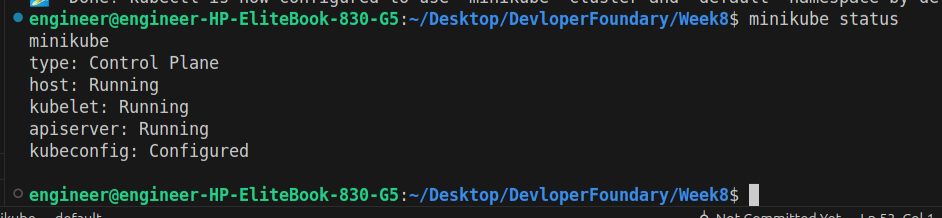
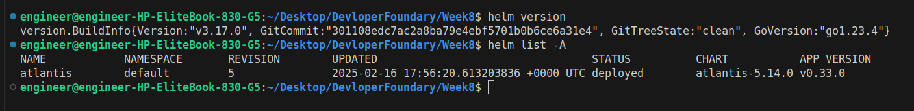
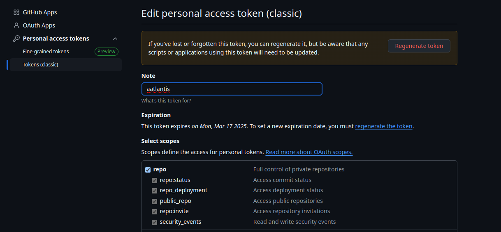
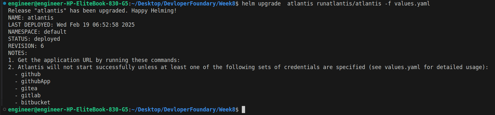
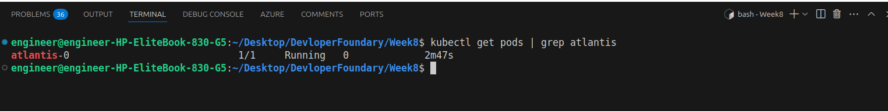
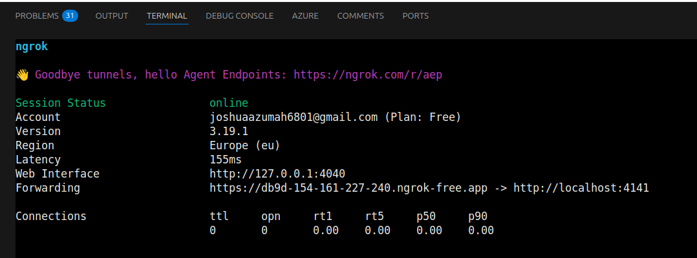
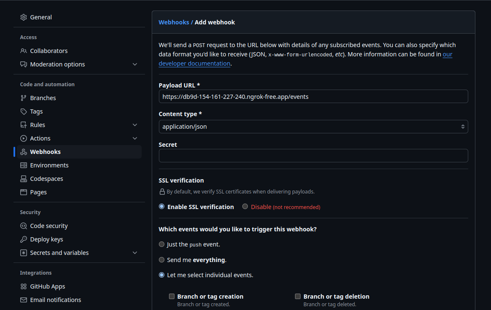
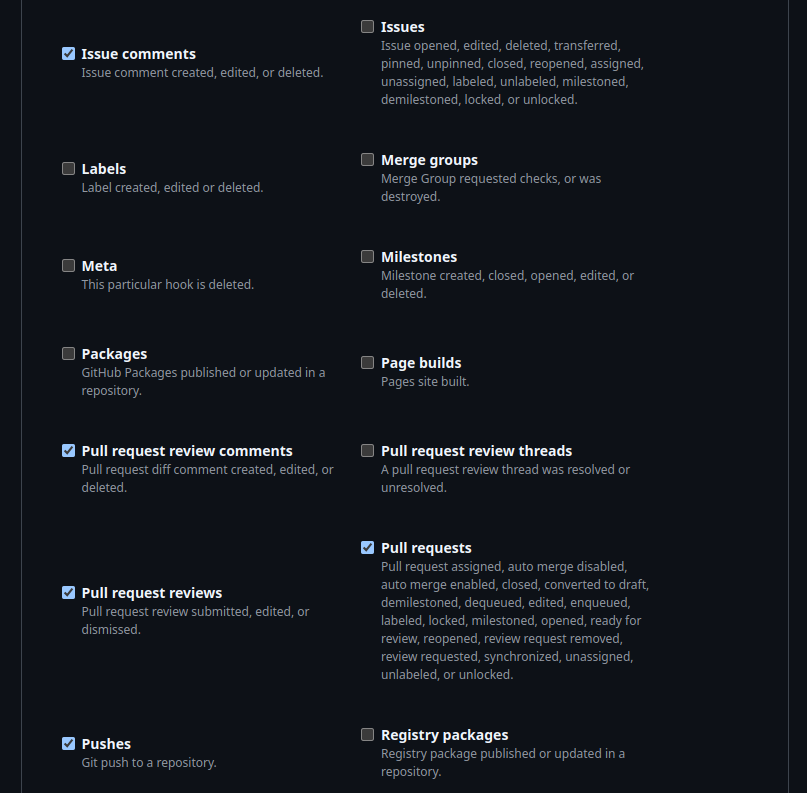

# Deploy A Core Bank App on AWS Using Terraform
In this project, we are migrating our core banking application from our data center to AWS. We will deploy our resources using Terraform.

This project is continuously updated, with new features added every week.


## Setting Up Terraform

### Step 1: Setting Up the VPC and Networking
- Create a VPC.
- Set up public and private subnets across two availability zones.
- Configure an Internet Gateway for public access.
- Add a NAT Gateway for private subnets to reach the internet.

### Step 2: Security Groups and IAM Roles
- Define security groups for each component.
- Restrict SSH access via a bastion host.
- Create IAM roles for EC2 instances.

### Step 3: Bastion Host (Jump Box)
- Deploy a Bastion Host in the public subnet.
- Allow only SSH access from specific IPs.

### Step 4: Internal Application Load Balancer
- Deploy an ALB in the public subnet.
- Attach Target Groups for EC2 instances.
- Enable Auto Scaling for EC2 instances.

### Step 5: EC2 Instances with Tomcat
- Deploy EC2 instances in private subnets.
- Install the Tomcat Server and deploy the Java application.

### Step 6: Database Layer
- Deploy Amazon RDS (Primary & Replica) in private subnets.
- Set up subnet groups and security groups.

### Step 7: Caching Layer
- Deploy Amazon ElastiCache (Redis) in private subnets.

### Step 8: Route 53 for Domain Resolution
- Set up Route 53 to point to the ALB.

---

# Deploy Atlantis Using Minikube in Kubernetes

This part of the project provides a guide to deploying Atlantis using Minikube in Kubernetes. Atlantis is a tool for automating Terraform workflows via pull requests. By the end of this guide, you will have a fully functional Atlantis deployment that integrates with GitHub.

---

## Prerequisites

Before starting, ensure you have the following tools installed:

1. **Minikube**: A tool to run a local Kubernetes cluster.
   - Installation: [Minikube Installation Guide](https://minikube.sigs.k8s.io/docs/start/)
2. **kubectl**: The Kubernetes command-line tool.
   - Installation: [kubectl Installation Guide](https://kubernetes.io/docs/tasks/tools/)
3. **Helm**: A package manager for Kubernetes.
   - Installation: [Helm Installation Guide](https://helm.sh/docs/intro/install/)
4. **GitHub Account**: To configure Atlantis with GitHub credentials.
5. **Ngrok**: A tool to expose local services to the internet.
   - Installation: [Ngrok Installation Guide](https://ngrok.com/download)

---

## Step 1: Start Minikube

Start a local Kubernetes cluster using Minikube:

```bash
minikube start
```

Verify that Minikube is running:
```bash
minikube status
```


## Step 2: Install Atlantis Using Helm

#### Add the Atlantis Helm Chart Repository

Add the official Atlantis Helm chart repository:

```bash
helm repo add runatlantis https://runatlantis.github.io/helm-charts
helm repo update
```

Check to make sure helm is installed 

```bash
helm version
```

#### Create a `values.yaml` File for Configuration

Generate a default `values.yaml` file to customize Atlantis:
```bash
helm inspect values runatlantis/atlantis > values.yaml
```

Verify if Atlantis is Installed in Minikube
```bash
helm list -A
```


## Step 3: Generate a Random Webhook Secret

Atlantis requires a secure webhook secret to validate incoming requests from GitHub. Generate a random secret using the following command:

```bash
openssl rand -hex 16
```

## Step 4: Create a GitHub Personal Access Token

Atlantis needs a GitHub personal access token to interact with your repositories. Follow these steps to create one:

1. Log in to your GitHub account.  
2. Go to **Settings > Developer settings > Personal access tokens** then chose **Token(classic)** from the drop down.  
3. Click **Generate new token**.  
4. Select the following scopes:  
   - **repo** (Full control of private repositories)  
   - **admin:repo_hook** (Full control of repository hooks)
5. Click **Generate token.**
6. Copy the token and save it securely (you won’t be able to see it again).



## Step 5: Edit `values.yaml` for Configuration

Edit the `values.yaml` file to include your GitHub credentials, webhook secret, and AWS credentials (if needed):

```yaml
github:
  user: "<your-github-username>"       # Replace with your GitHub username
  token: "<your-github-token>"         # Replace with your GitHub personal access token
  secret: "<your-webhook-secret>"      # Replace with the random secret you generated

orgAllowlist: "github.com/<your-org>/*" # Replace with your GitHub organization or user

# Optional: Add AWS credentials if needed
aws:
  accessKey: "<your-aws-access-key>"   # Replace with your AWS access key
  secretKey: "<your-aws-secret-key>"   # Replace with your AWS secret key
```

## Step 6: Deploy Atlantis with the Custom Configuration

Install Atlantis using Helm and the customized `values.yaml` file:

```bash
helm install atlantis runatlantis/atlantis -f values.yaml
```

Or, if Atlantis is already installed, use:

```bash
helm upgrade atlantis runatlantis/atlantis -f values.yaml
```



## Step 7: Verify Deployment

Check if the Atlantis pod is running:

```bash
kubectl get pods
```

You should see a pod named `atlantis-*` in the default namespace with a status of `Running.`



## Step 8: Set Up Ngrok to Expose Atlantis to the Internet

Since GitHub webhooks require a publicly accessible URL, we'll use Ngrok to expose Atlantis to the internet.

### Install Ngrok  

Download and install Ngrok from [Ngrok's official website](https://ngrok.com/download).

### Start Ngrok  

Run Ngrok to expose the Atlantis service:

```bash
ngrok http 4141
```



## Step 9: Expose Atlantis Service

To access Atlantis locally, use `kubectl port-forward:`

```bash
kubectl port-forward svc/atlantis 4141:80
```

Now, you can access Atlantis in your browser at `http://localhost:4141.`

## Step 10: Configure GitHub Webhook

To enable Atlantis to respond to GitHub events, configure a webhook in your GitHub repository:

1. Go to your GitHub repository.  
2. Navigate to **Settings > Webhooks > Add Webhook**.  
3. Set the following values:

   - **Payload URL**: `https://db9d-154-161-227-240.ngrok-free.app/events`  
   - **Content type**: `application/json`  
   - **Secret**: Use the same secret you configured in `values.yaml`.  
   - **Select events**: Choose the events you want Atlantis to handle 
   - Check the boxes
     - **Pull requests reviews**
     - **Pushes**
     - **Issue comments**
     - **Pull requests**
   - leave **Active** Checked
   - click **Add Webhook**





## Step 11: Test the Deployment

### 1. Create a New Branch

Before testing Atlantis, create a new branch for your changes:  

```bash
git checkout -b dev
```

### 2. Push Changes to Github

Make the necessary updates to your Terraform code. Once done, commit and push the changes:

```bash
git add .
git commit -m "Commit message"
git push -u origin dev
```
